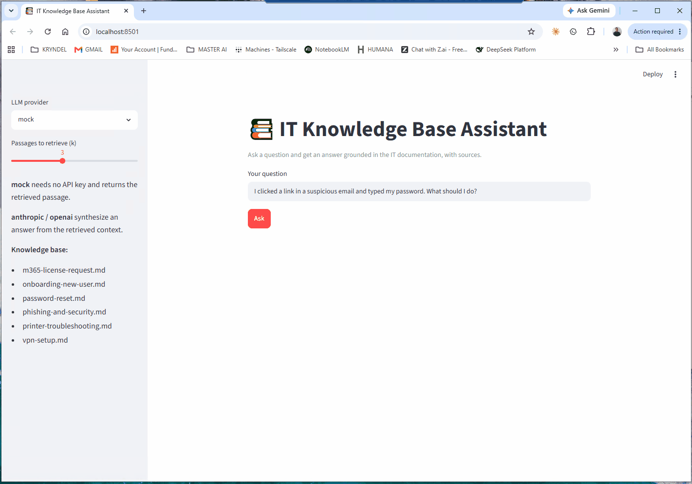

# 📚 IT Knowledge Base Assistant (RAG)

> An **AI assistant** that answers natural-language questions over a set of IT documents and **cites its sources** — a from-scratch Retrieval-Augmented Generation (RAG) app that runs with zero setup and upgrades to a live LLM with one environment variable.

Built to show the core of RAG without a framework: document chunking, TF-IDF retrieval, grounded generation, and source citations.



---

## The problem

Internal IT documentation is scattered across runbooks, wikis, and shared drives. Staff can't find answers fast, so they open tickets for things that are already documented. This assistant lets anyone ask in plain language and get an answer grounded in the actual docs — with the source named, so it's trustworthy.

## What it does

Ask a question → it retrieves the most relevant passages from the knowledge base → it answers using only those passages and tells you which documents it used.

```
question ──> TF-IDF retriever ──> top-k passages ──> LLM (Claude / OpenAI) ──> grounded answer + sources
                                        │
                                        └── no API key? ──> returns the most relevant passage (extractive)
```

See [`sample_qa.md`](sample_qa.md) for real questions and answers.

## Why it's built this way

- **RAG from first principles** — chunking, a TF-IDF vector index, and cosine retrieval are implemented in pure Python (standard library only), so the retrieval logic is transparent rather than hidden behind a framework.
- **Grounded + cited** — the model is instructed to answer *only* from retrieved context and cite sources; every response lists the documents it drew from. This is how you reduce hallucination in enterprise assistants.
- **Runs anywhere** — `mock` mode needs no API key and no dependencies, returning the retrieved passage. Add a key to get synthesized answers. Same code path, graceful fallback if a call fails.
- **Provider-agnostic** — Claude or OpenAI via one environment variable.

## Quick start

```bash
git clone https://github.com/rperezga/it-knowledge-base-assistant.git
cd it-knowledge-base-assistant

# Ask a question (mock mode — no setup needed)
python rag.py "How do I reset my password?"
python rag.py "Why does my VPN keep disconnecting?" --k 4 --pretty
```

### Synthesized answers with a live LLM (optional)

```bash
pip install -r requirements.txt
cp .env.example .env        # set LLM_PROVIDER and your API key
python rag.py "What do I need to onboard a new hire?" --provider anthropic
```

### Web UI (optional)

```bash
pip install streamlit
python -m streamlit run app.py
```

## Bring your own docs

Drop any `.md` files into the `docs/` folder and ask away — the index is built at runtime. The included sample knowledge base covers onboarding, password/lockout, VPN, M365 licensing, printers, and phishing.

## Tech stack

`Python` · `Retrieval-Augmented Generation (RAG)` · `TF-IDF retrieval (from scratch)` · `Anthropic / OpenAI APIs` · `Streamlit`

## Project structure

```
rag.py              # load -> chunk -> TF-IDF index -> retrieve -> generate (CLI)
app.py              # Streamlit chat UI
docs/               # the knowledge base (sample IT documents)
sample_qa.md        # real example questions and answers
requirements.txt    # optional dependencies
.env.example        # configuration template
```

## Roadmap

- Swap TF-IDF for vector embeddings (OpenAI/Anthropic or a local model) for semantic search.
- Persist the index (FAISS/Chroma) for larger document sets.
- Ingest PDFs and SharePoint exports, not just Markdown.
- Deploy the Streamlit app so it can be tried live.

---

**Author:** Roger Perez — AI Solutions Builder (LLM apps · Low-Code/No-Code) · Miami, FL
MIT licensed.
